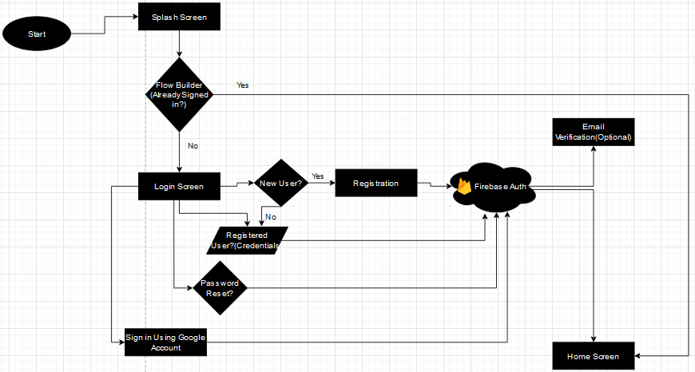

# e-CART: A Flutter e-commerce App (Android, iOS) using BLOC pattern

A work-in-progress mobile app that features:

- Bloc(Cubit) pattern to separate business logic from UI, 
- Firebese Authentication
- Firebase Firestore as back-end
- Stripe for payments
- Clean Architecture

# Login Flow

# Bloc Pattern

# App Screenshots

  
   
  

  
   
  

 
    
  
  

 
  
  

 

